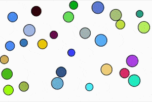

## Rust event driven simulation

Event-driven programming is a widely spread technique used in many areas, from web servers to physical simulations.  
This project aims to implement a relatively simple 2D particle collision system. That's it, we have some closed domain, several obstacles, and a bunch of moving particles. Particles can have different radiuses and masses. Obstacles and domain consist of straight-line segments. To calculate physics I used an idealized [hard disc model](https://introcs.cs.princeton.edu/java/assignments/collisions.html).

The project is mainly based on the chapter from Princeton algorithm course (II part). Check it out [here](https://algs4.cs.princeton.edu/61event/). It contains a lot of useful information and good references to scientific papers about this topic. Another source I used was rust-wasm Convey's game of life implementation [guide](https://rustwasm.github.io/docs/book/game-of-life/implementing.html).

Check out the [live example](https://reds.greshilov.me).

The project contains following components:

- red-simulation
- red-demonstration
- red-server

## red-simulation

Rust library with all this fancy `event-driven` logic and physical calculations inside.
Built using `wasm-pack` tools into a `.wasm` module. All core functionality can be found there.

## red-demonstration

Vue3 application with `red-simulation` wasm library as a dependency. Created with demonstration purposes.

## red-server

A small web server that's written on rust using `rocket` and `diesel`. Created to store game results from the [live example website](https://reds.greshilov.me).

## How to build

See detailed instructions in child directories. Better yet you can find ready-to-go example in the `example` subdirectory.
